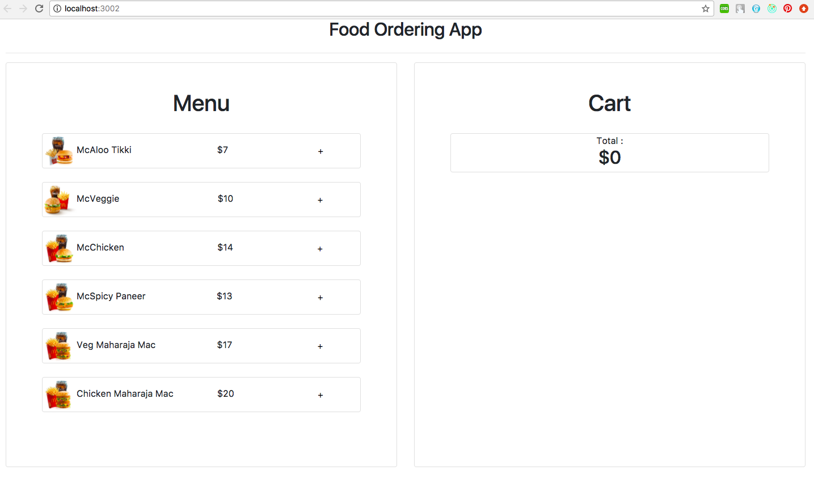
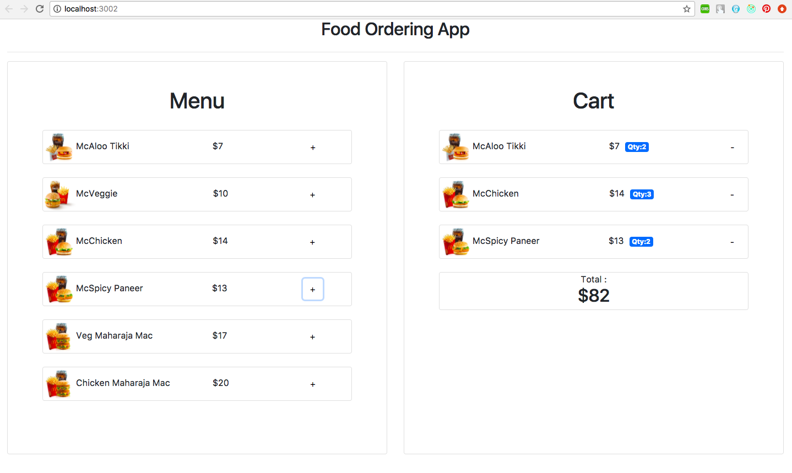
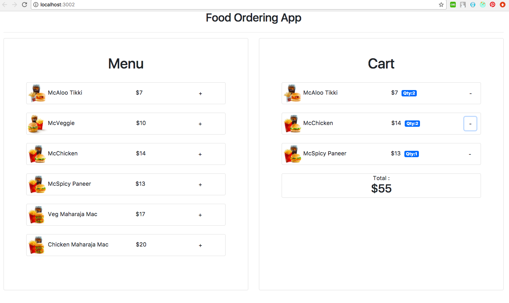

# FoodCart_demo

Food Cart App using technologies:

• Frontend: ReactJs

Features:

• Add items to the cart  
• Delete items from the cart  
• Can see the total at the bottom

Steps to run the application:

1. npm install
2. npm start

Below are some screenshots demonstrating the application:

### Welcome Page

### Add the items

### Delete the items

